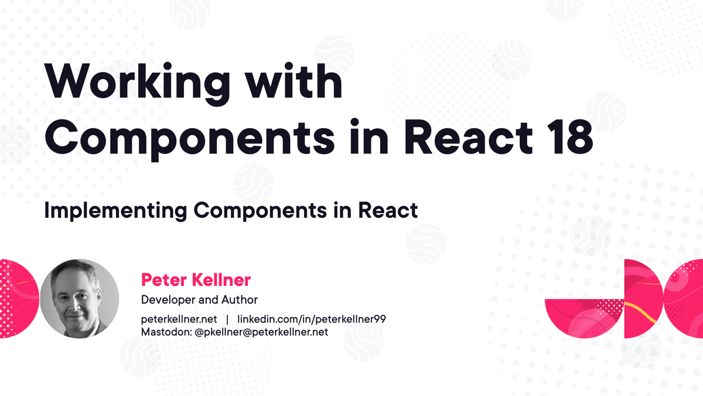

# Course Code for [Designing React Components](https://app.pluralsight.com/library/courses/react-components-designing) on Pluralsight

# IMPORTANT NOTICE: Updated Course: [Working with Components in React 18 (Released February 2023)](https://www.pluralsight.com/library/courses/react-18-working-components)

This new course **"Working with Components in React 18"** covers all the learnings covered in **this course** as well as the new React
Hooks `useTransition` and `useDeferredValue` and how those work with components. It also has an introduction to the new Server Components which is
part of what comes with the new Concurrent Rendering Engine in React 18. The new course incorporates a lot of feedback from this course i
ncluding more focus on React and less focus on the build chain NextJS. 

There is nothing inaccurate in this course regarding hooks, the newer course is improved and more up to date in all regards.

## OTHER Recently Released Courses From Peter Kellner

| **Course**                                                                           | Release Date  |
|-------------------------------------------------------------------------------------------------------------------------------|---------------|
| **[Using Hooks in React 18](https://pluralsight.com/courses/react-18-using-hooks/)**                                          | November 2022 |
| **[What is React](https://pluralsight.com/courses/react-what-is/)**                                                           | August 2022   |
| **[What's New in React 18](https://pluralsight.com/courses/react-18-whats-new/)**                                             | May 2022      |
| **[Data and UI Patterns in React](https://github.com/pkellner/pluralsight-building-essential-ui-data-elements-in-react/)**    | December 2021 |

The master branch here is the latest updates to the Pluralsight course published by Peter Kellner in May of 2021 in the master branch. This GitHub repo includes the final code for all the modules in the course 

# Course Description

Creating UIs in React is all about creating independent components that seamlessly work together to present a consistent view across your web app. In this course, Designing React Components, you will gain the ability to architect and build high quality web apps, that ensures just the right components re-render as the data in your applications changes. First, you will learn how separation of concerns applies to building React components. Next, you will discover the various primitive methods for sharing data and methods between components. Finally, you will explore how to use Context for establishing shared information and use custom hooks for advanced state management. When you are finished with this course, you will have the skills and knowledge of React component design needed to leverage re-usability and ensure consistency in your apps and code with less bugs.

# Getting Started
1. **Install [Node 16 with NPM 6.14.12](https://nodejs.org)**.
2. **Clone this repository.** - `https://github.com/pkellner/pluralsight-designing-react-components-course-code` or [download the zip](https://github.com/pkellner/pluralsight-designing-react-components-course-code/archive/master.zip)
3. **Set your default directory to which module you want (example: `cd 02-designing-better-components` - `cd clip-02-setting-up-our-dev-environment`
4. **Install Node Packages with Dependencies.** - `npm install`

# Directory Structure Here

Each of the 7 folders here represent one module of the course.  In each folder, there are subfolders that represent the completed code at the end of each clip. Where this is no clip reference, either there is no code in that clip or nothing changed from the previous clip.

Once in a clip directory, the easiest way to test the app is to first install the packages by typing at the root of that directory (in a terminal window or DOS prompt)

`npm install`

Then, do run the app you just need type

`npm run dev`

And that will launch the web server on port 3000 where you can browser to it at the url: `http://localhost:3000`

## [Release Notes](https://github.com/pkellner/pluralsight-designing-react-components-course-code/blob/Course-Update-May-2021/ReleaseNotesMay2021.md)

Original course source code can be found in the branch [Course-Release-May-2020](https://github.com/pkellner/pluralsight-designing-react-components-course-code/tree/Course-Release-May-2020)

# Repo or Course Issues

If you find any problems or issues, feel free to post it as an issue here at this forum and I will look into it as soon as I can. You can also contact me directly at http://peterkellner.net/contact/

I hope you enjoy the course!

